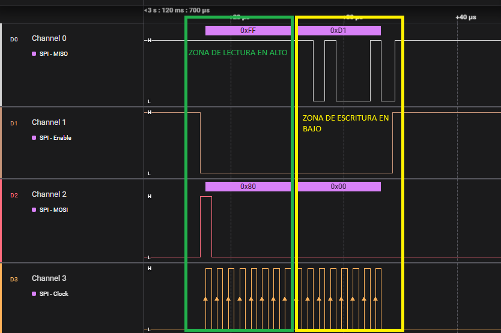

# ROBOT JUSTICIERO:

## COMPONENTES:
  - **Placa ESP32 (NodeMCU-32S) CP2102**
    - **https://es.aliexpress.com/item/1005005396344075.html?spm=a2g0o.order_detail.order_detail_item.13.234c39d3MOXRRQ&gatewayAdapt=glo2esp**

  - **Módulo BMI160 6DOF**
    - **https://es.aliexpress.com/item/1005007565617067.html?algo_pvid=678f960b-657e-4704-8589-539b47a3b249&pdp_ext_f=%7B%22order%22%3A%22213%22%2C%22eval%22%3A%221%22%7D&utparam-url=scene%3Asearch%7Cquery_from%3A**

  - **CONTROLADORA MOTOR DUAL TB6612FNG**
    - **https://es.aliexpress.com/item/1005007697554890.html?spm=a2g0o.productlist.main.1.d665310cdt8LGO&algo_pvid=b56d249d-e321-4f1b-b50c-dc702810910b&pdp_ext_f=%7B%22order%22%3A%22343%22%2C%22eval%22%3A%221%22%7D&utparam-url=scene%3Asearch%7Cquery_from%3A**

  - **MOTORES**
    - **https://es.aliexpress.com/item/1005007227331566.html?spm=a2g0o.productlist.main.1.4fceXObwXObwhK&algo_pvid=26e4f6f1-e173-4035-90b1-b559a2ecf1c3&pdp_ext_f=%7B%22order%22%3A%221281%22%2C%22eval%22%3A%221%22%7D&utparam-url=scene%3Asearch%7Cquery_from%3A**

  - **CHASIS 2WD**
    - **https://es.aliexpress.com/item/1005006712934485.html?spm=a2g0o.order_list.order_list_main.27.2122194dC6p7NH&gatewayAdapt=glo2esp**
  


## Driver SPI para BMI160 en ESP32
Documentación técnica y explicación del proyecto de comunicación con el sensor BMI160 mediante SPI.

---

## Capítulo 1: Configuración Básica e Inicialización

### Hardware Utilizado
- **Placa**: ESP32 (NodeMCU-32S)
- **Sensor**: BMI160 (Acelerómetro/Giroscopio)
- **Conexiones SPI**:
  | Pin ESP32 | Función  | Pin BMI160 |
  |-----------|----------|------------|
  | GPIO23    | MOSI     | SDO/SDI    |
  | GPIO19    | MISO     | SDA/SDO    |
  | GPIO18    | SCLK     | SCL        |
  | GPIO5     | CS       | CSB        |

---

### Explicación de Máscaras y Decisiones Técnicas

#### **Máscara `0x80`**
- **Propósito**: Habilitar modo de lectura.
- **Detalle**:  
  El BMI160 requiere que el bit 7 (MSB) de la dirección del registro sea `1` para operaciones de lectura (ver sección 5.2 del datasheet).  
  **Ejemplo**:  
  `0x7F (dirección) | 0x80 = 0xFF (operación de lectura)`.

#### **Modo 0 SPI 3**
- **Elección**:  
  El BMI160 soporta modos 0 (CPOL=0, CPHA=0) y 3 (CPOL=1, CPHA=1).  
  Se seleccionó el modo 0 por:
  - Compatibilidad con configuraciones estándar.
  - Menor consumo energético en estado inactivo (CLK en LOW).

#### **Frecuencia de 1 MHz**
- **Razón**:  
  - Límite máximo seguro para evitar errores de sincronización inicial.
  - Dentro del rango soportado por el sensor (hasta 10 MHz en modo SPI).
  - Permite margen para futuras optimizaciones.

#### **GPIO5 como CS**
- **Base**:  
  Según el diagrama de referencia del [Waveshare NodeMCU-32S](https://www.waveshare.com/img/devkit/accBoard/NodeMCU-32S/NodeMCU-32S-details-3.jpg), GPIO5 está libre y es adecuado para CS.


#### **TRANSMISION**
- **LECTURA**:
  MOSI primer bit en alto.

- **ESCRITURA**:
  MOSI primer bit en bajo.





---

### Estructura del Código
```txt

/Proyecto
├── src/
│   ├── main.cpp                            # Punto de entrada
│   ├── localBmi160.cpp                     # Implementación del driver SPI del BMI160
│   ├── localBmi160.h                       # Cabeceras del driver SPI del BMI160
│   ├── classServo.cpp                      # Implementación del controlador del servo
│   ├── classServo.h                        # Cabeceras del controlador del servo
│   ├── motorController.cpp                 # Implementación del controlador del motor
│   ├── motorController.h                   # Cabeceras del controlador del motor
│   └── CMakeLists.txt                      # Configuración de CMake para el proyecto
├── include/
│   └── README                              # Información sobre el uso de archivos de cabecera
├── lib/
│   └── README                              # Información sobre el uso de bibliotecas privadas
├── docs/
│   ├── BOM-Justiciero.xlsx                 # Lista de materiales
│   ├── bst-bmi160-ds000.pdf                # Datasheet del sensor BMI160
│   ├── Curso_Robotica_2_I2c_spi.pptx.pdf   # Presentación del curso
│   └── img/
│       └── PrimeraTransmision.png          # Imagen de la primera transmisión
├── test/
│   └── README                              # Información sobre pruebas unitarias
├── .gitignore                              # Archivos y carpetas a ignorar por Git
├── platformio.ini                          # Configuración de PlatformIO
├── sdkconfig.esp32doit-devkit-v1           # Configuración del SDK para ESP32
└── README.md                               # Documentación del proyecto
```